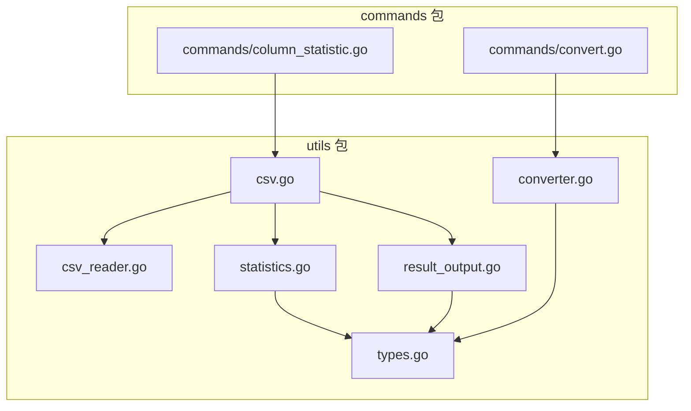

# utils 包模块说明

## 概述

utils 包是 XCel 项目的核心工具包，提供了 Excel 和 CSV 文件处理的各种功能。

## 模块结构

utils 包包含以下模块文件：

1. **csv.go** - CSV 分析主入口
2. **csv_reader.go** - CSV 文件读取和列处理
3. **excel.go** - Excel 文件处理和转换
4. **result_output.go** - 统计结果输出
5. **statistics.go** - 数据分析和统计
6. **types.go** - 数据类型定义

## 模块依赖关系



## 模块功能说明

### 1. types.go

定义了数据处理中使用的核心结构体：

- `Bucket` - 桶统计结果结构体
- `ColumnStats` - 列统计结果结构体

### 2. csv_reader.go

负责 CSV 文件的读取和列处理：

- `readCSVFile()` - 读取 CSV 文件并返回行数据和列名
- `determineColumnsToAnalyze()` - 确定要分析的列索引
- `parseColumnSpec()` - 解析列规范，支持列名或列号

### 3. statistics.go

实现了数据分析和统计功能：

- `performStatistics()` - 根据统计类型执行不同的统计逻辑
- `performSetStatistics()` - 执行 set 统计逻辑（去重统计）
- `performBucketStatistics()` - 执行 bucket 统计逻辑（区间统计）

### 4. result_output.go

负责统计结果的输出和保存：

- `outputResults()` - 输出统计结果，包括控制台输出和 JSON 文件保存

### 5. csv.go

CSV 分析的主入口：

- `AnalyzeCSVColumns()` - 分析 CSV 文件的列统计信息并以 JSON 格式输出

### 6. converter.go

Excel 和 CSV 文件转换功能：

- `ConvertExcelToCSV()` - 将 Excel 文件转换为 CSV 文件
- `ConvertCSVToExcel()` - 将 CSV 文件转换为 Excel 文件

## 调用关系

1. **Excel 转 CSV**：
   - `commands/convert.go` → `utils/converter.go:ConvertExcelToCSV()`

2. **CSV 转 Excel**：
   - `commands/convert.go` → `utils/converter.go:ConvertCSVToExcel()`

3. **CSV 列统计**：
   - `commands/column_statistic.go` → `utils/csv.go:AnalyzeCSVColumns()`
   - `utils/csv.go:AnalyzeCSVColumns()` → `utils/csv_reader.go:readCSVFile()`
   - `utils/csv.go:AnalyzeCSVColumns()` → `utils/csv_reader.go:determineColumnsToAnalyze()`
   - `utils/csv.go:AnalyzeCSVColumns()` → `utils/statistics.go:performStatistics()`
   - `utils/csv.go:AnalyzeCSVColumns()` → `utils/result_output.go:outputResults()`

## 版本历史

- v0.0.1 - 初始版本，包含基本的 Excel 和 CSV 转换功能
- v0.0.2 - 新增 CSV 列统计功能
- v0.0.3 - 重构模块结构，拆分代码到多个文件

## 开发指南

### 添加新功能

1. 确定功能所属的模块或创建新模块
2. 遵循现有的代码风格和命名约定
3. 确保新功能与现有模块的依赖关系清晰
4. 更新 README.md 中的模块依赖关系图

### 测试

使用项目根目录下的测试文件进行测试：

```bash
# 测试 Excel 转 CSV
./xcel convert data/input/excel/test.xlsx

# 测试 CSV 列统计
./xcel col_stat data/input/csv/Sheet1.csv -c 1 -t set
```
